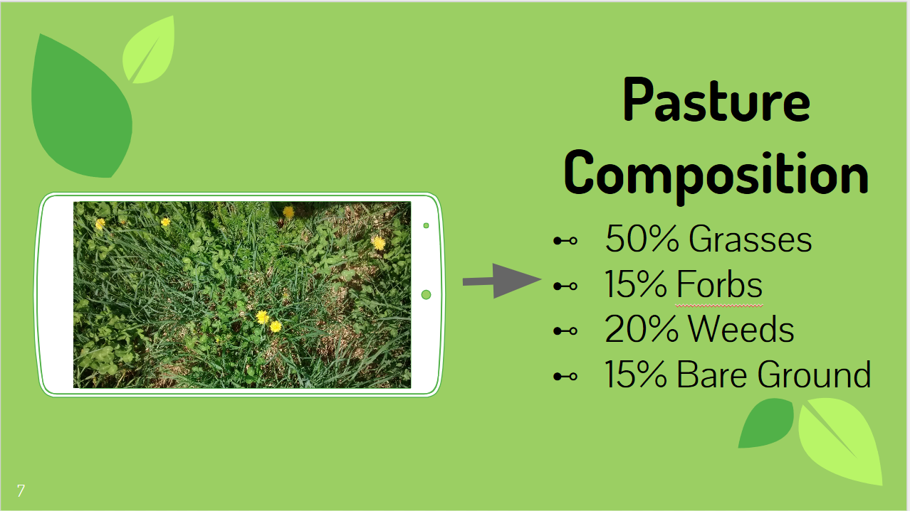
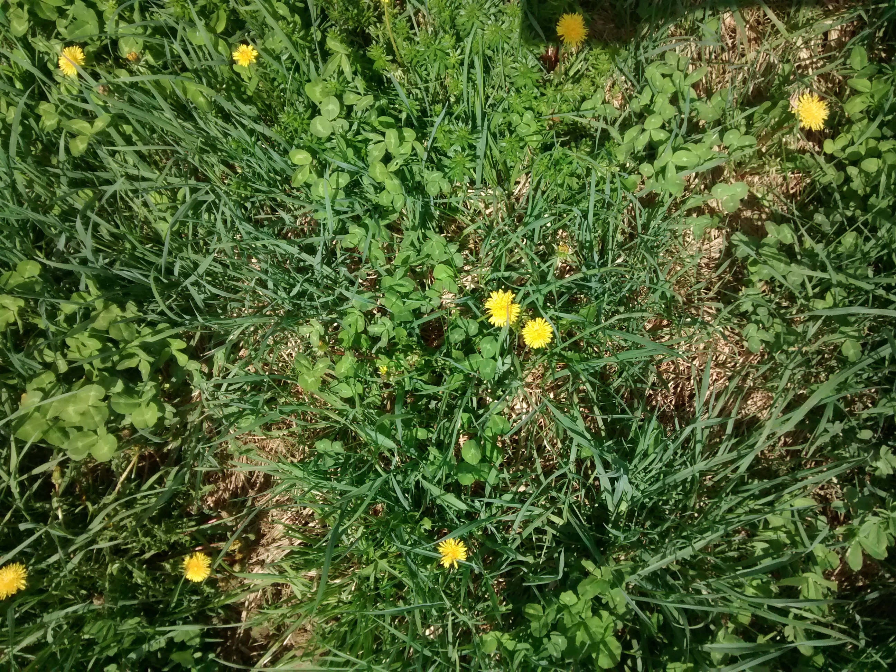
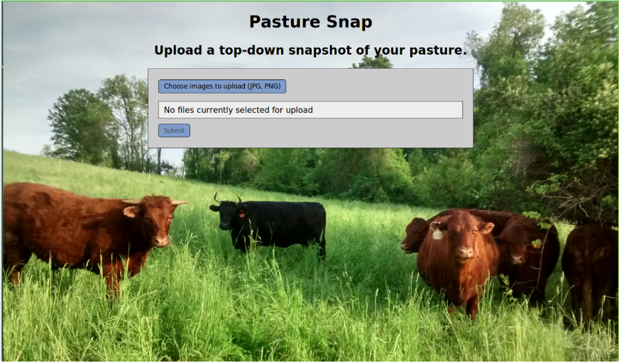
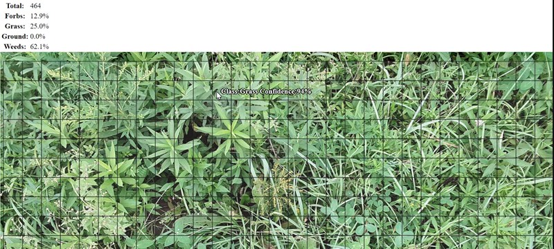

### Work in Progress - Last updated 10/13/2018

# Pasture Snap

Pasture Snap is an application that allows you to evaluate your pasture quality with the snap of a photo.

# Background
Pasture is grass managed as feed for animals. It is important to evaluate your pasture quality because your grazing animals only do as well as your pasture does. More experienced farmers have a feel for their pasture quality, but to actually quantify that, what farmers currently do is to look at a few randomly sampled sections of their pastures like the photo below and try to approximate the composition by eye. I came up with Pasture Snap to try to do this more efficiently and accurately, especially for someone who doesn’t have as much experience. 

# Approach

I took an iterative approach to this project, beginning with a simpler binary classification problem and gradually expanding the data sources and model capabilities to address my question of evaluating pasture quality from a field photo. I go into detail about that in my [blog post](link). I will focus on the final model on this page.  

# Data

[Pl@ntnet](https://identify.plantnet-project.org/explo/namerica/) is a crowd sourced database of labeled plant images. I switched to this database from ImageNet because it is plant focused and separates the photos by organ, so it actually contains a fair amount of closeups on organs like the leaves. Other databases are dominated by photos of the flowers, as that is usually the most distinguishing, and often most beautiful, feature of a plant. This is important in pasture photos because for optimal forage quality, pasture plants should be grazed before they go to seed and flower and you can only rely on the leaves and other features for identification.

I used [Selenium WebDriver](https://pypi.org/project/selenium/) to load the javascript gallery on Pl@ntnet and scrape image urls for a list of grasses, weeds and forbs of interest. I then downloaded the images with the [Requests](http://docs.python-requests.org/en/master/). Ground images were downloaded from [Texture Library](http://texturelib.com/#!/category/?path=/Textures/soil). Additional photos of grass were added from the [Open Sprayer dataset's](https://www.kaggle.com/gavinarmstrong/open-sprayer-images/home) non-dock images. The train_test_split script shuffles the photos from my four classes and split them 80/20 into train and test folders. 

The classes were imbalanced:
* Grasses = 49%
* Ground = 1%
* Forbs = 13%
* Weeds = 37%

### Total: 21250 train images, 3430 test images

# CNN Image Classifier

I used a deep convolutional neural network (CNN) because it has become the standard for image recognition problems. The base model was VGG16, with the top layers replaced with two dense layers trained to classify my four classes. I further fine tuned the model by unfreezing the fifth convolutional block from the VGG16 model to retrain those weights that for my problem.  

I made a key modification to the Keras default ImageDataGenerator to take random 224x224 crops of the images before any augmentation to maintain their aspect ratios. Credits to Oeway and Stratospark from this [Keras issue thread](https://github.com/keras-team/keras/issues/3338). The augmentation techniques I used included random zooming, rotating, and shearing. 

## Results

The classifier I deployed to the application achieved a macro F1 score of 88%. It performed well on the grass and ground images, but had some confusion between weeds and forbs. 
<!-- This makes sense because weeds are defined only as plants that are undesirable and can therefore look very similar to a forb. Confirm by looking at confused images.  -->

# Image Segmentation 

While a good classifier is crucial, it only classifies individual plants when my goal is to actually estimate the pasture composition by class based on a snapshot from the field that is densely populated by all types of plants. One simple way to bring the two together is to take crops of the photo to segment it into small subimages, which reduces the plant variety within that subimage to one main plant, and feed them into my classifier. Once I have the labels for the individual subimages, I can add them up and report the percentage each class makes up. 

## Flask Application

To make this process easier, I made a flask application to interface the model. You can upload your own pasture photo, taken from a top down perspective, and get the results. 

The top part gives you how many subimages the original photo was segmented into and the overall percentages of the classes. The mage is also overlaid with the actual cropping edges so that you can hover over and see how the model did classifying each subimage. 

# Improvements to come (soon)

* Label and train on subimages generated by new inputs to application

